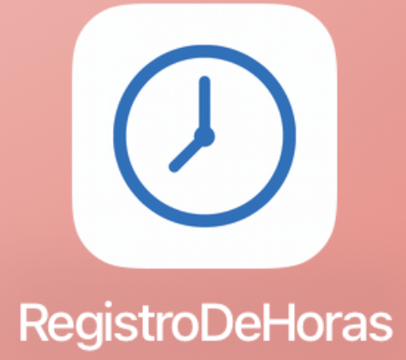
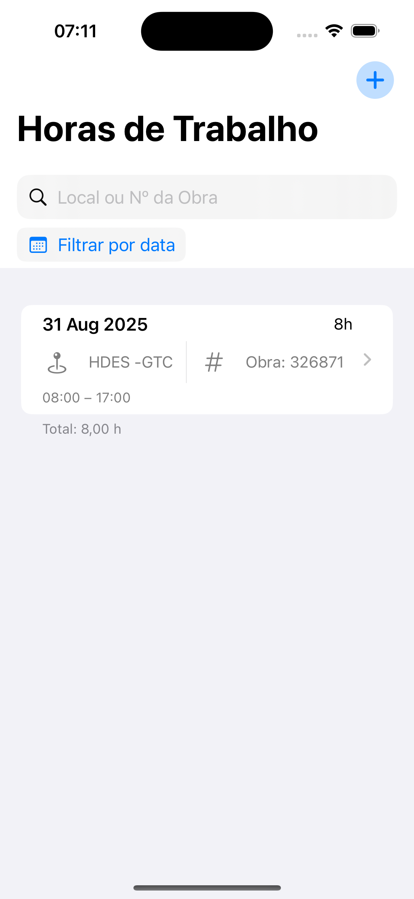
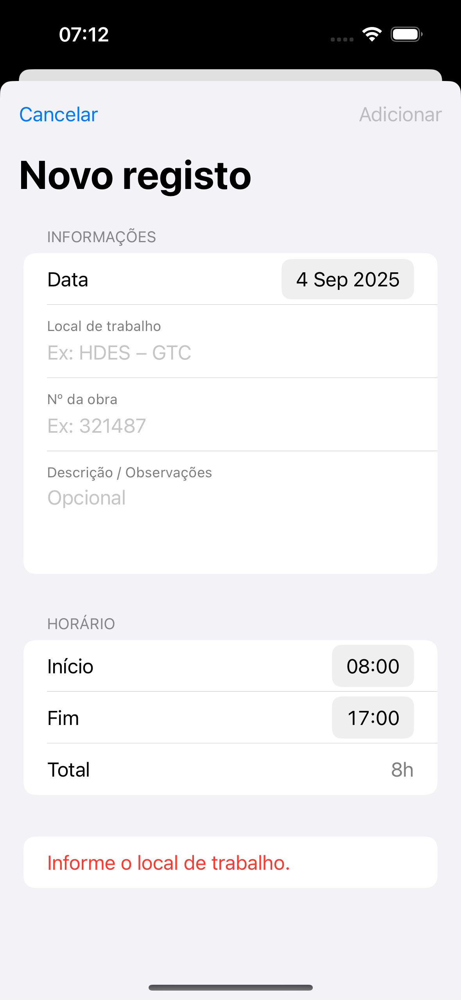

# Registro de Horas (iOS, SwiftUI + SwiftData)
App para registar horas (Data, Local, Nº da obra, Início/Fim, Descrição), desconto de almoço, busca, filtro por data e splash.
Requer iOS 17+ e Xcode 15+.

#Screenshots

### Icone do App

### Lista de Registros

### Formulário de Novo Registro

